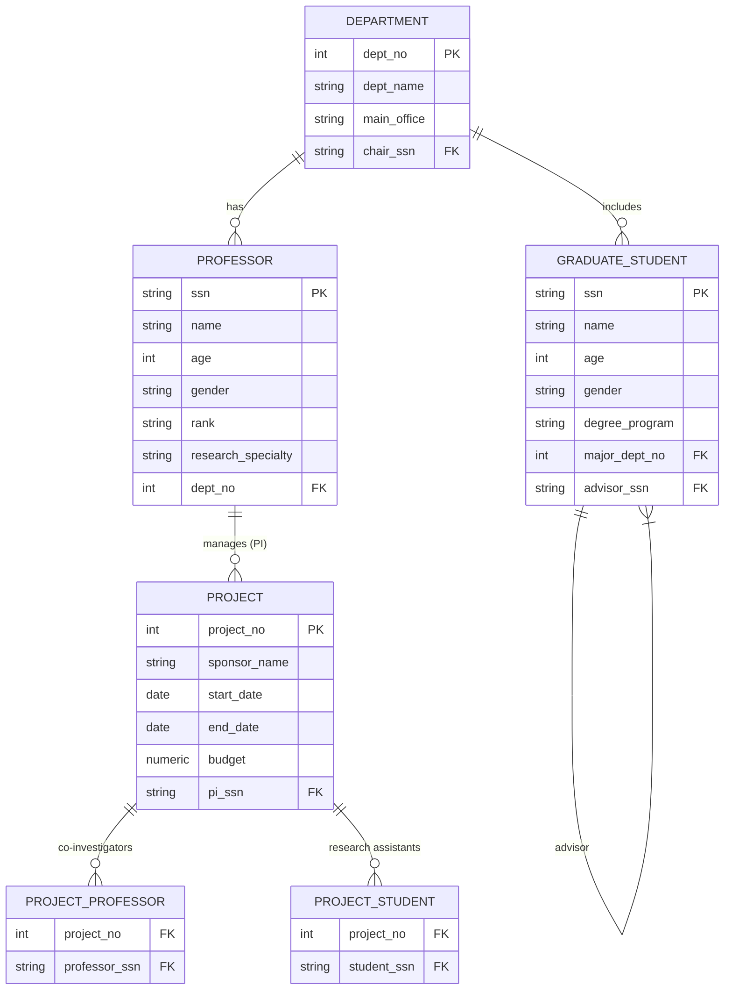

# University Database Project (PostgreSQL + Java)

**Important:** The Java app is configured to connect to `cs1.calstatela.edu` — update only the **database name, username, and password** in `App.java`. Do **not** point to `localhost`.

## What’s included
- `schema.sql` — ER-to-relational mapping, constraints, functions, triggers, and sample data
- `App.java` — JDBC client (Add/Remove project, Student info + advisor + major, Faculty’s projects). Also includes calls to required functions.
- `CONTRIBUTIONS_TEMPLATE.txt` — fill with each member’s name and % contribution.
- ER diagram (Mermaid) — paste into your doc/PDF.

## ER Diagram (Mermaid)


## Assumptions & constraints not fully expressible in ER
- **Exactly one chair per department** is enforced via a `UNIQUE` chair_ssn plus trigger validating chair belongs to the same department.
- **Advisor is more senior** approximated by `entry_year` (advisor’s entry year must be earlier than advisee’s) via trigger.
- Co-PI limit and student ≤2 projects are enforced by triggers (`faculty_restrict`, `student_restrict`), not by static constraints.

## Setup (once per group)
```bash
# On cs1.calstatela.edu PostgreSQL (psql):
\i schema.sql

# Try some sanity checks:
SELECT set_config('search_path','university',false);
SELECT female_faculty();
SELECT total_people('P100');
```

## Compile & Run Java
1. Ensure PostgreSQL JDBC driver (`postgresql-42.x.x.jar`) is on your classpath.
2. Edit `App.java` and set `DB_NAME`, `USER`, `PASS`.
3. Compile:
```bash
javac -cp .:postgresql-42.7.4.jar App.java
```
4. Run:
```bash
java -cp .:postgresql-42.7.4.jar App
```

## What to submit
- A **doc/pdf** containing: ER diagram, schema diagram summary, `CREATE TABLE` DDL, function/trigger source, and contribution percentages.
- `App.java` (Java source).
- A separate list of member contributions (%). You can start from `CONTRIBUTIONS_TEMPLATE.txt`.
